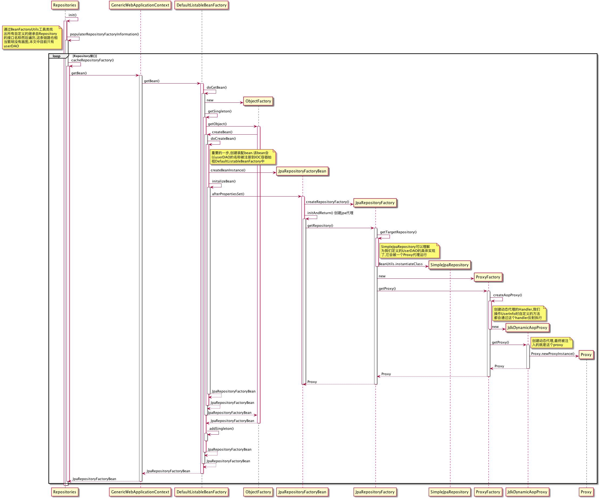

## ch0302_jpa-complex-demo

通过 `Spring Data JPA` 操作数据库

### Repository
* 启用 `@EnableJpaRepository`
* 关闭 `@NoRepositoryBean`, 用于继承结构
* `Repository<T, ID>` 接口
    * `CrudRepository<T ,ID>`
    * `PagingAndSortingRepository<T ,ID>`
    * `JpaRepository<T ,ID>`

### 定义查询
#### 根据方法名定义查询
* `find...By... / read...By... / query...By... / get...By...`
* `count...By...`
* `...OrderBy...[Asc / Desc]`
* `And / Or / IgnoreCase`
* `Top / First / Distinct`
#### 分页查询
* `PagingAndSortingRepository<T, ID>`
* `Pageable / Sort`
* `Slice<T> / Page<T>`

### Repository Bean 如何创建的
* `JpaRepositoriesRegistrar`
    * 激活了 `@EnableJpaRepositories`
    * 返回了 `JpaRepositoryConfigExtension`
* `RepositoryBeanDefinitionRegistrarSupport.registerBeanDefinitions`
    * 注册 Repository Bean(类型是 `JpaRepositoryFactoryBean` )
* `RepositoryConfigurationExtensionSupport.getRepositoryConfigurations`
    * 取得 Repository 配置
* `JpaRepositoryFactory.getTargetRepository`
    * 创建了了 Repository

### 接口中的⽅法是如何被解释的
* `RepositoryFactorySupport.getRepository` 添加了`Advice`
    * `DefaultMethodInvokingMethodInterceptor`
    * `QueryExecutorMethodInterceptor`
* `AbstractJpaQuery.execute` 执⾏具体的查询
* 语法解析在 `Part` 中

[JPA流程原理](https://www.jianshu.com/p/fafd058911ca)

